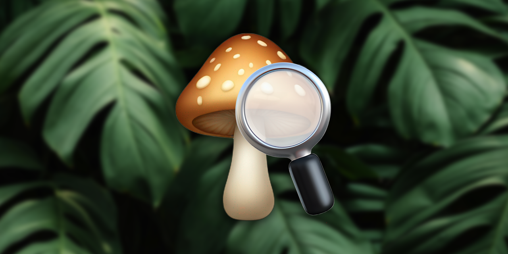

<h1 align="center">shroomID</h1>

<p align="center">
    
    
</p>

## Problem
When forgaging for wild mushrooms, it can be difficult to accurately predict whether or not a species of mushroom is safe for human consumption. To address this, we can use machine learning to develop a classification model that is capable of automatically distinguishing edible mushrooms from poisonous mushrooms.

## Solution
The purpose of developing this model is to help automate the identification of poisonous mushrooms and reduce the risk of misclassification and potential harm. Using attributes such as cap shape, gill size, odor, etc., a reliable model can be built.

## Dataset
From the UCI Machine Learning repository, the [mushroom](https://archive.ics.uci.edu/dataset/73/mushroom) dataset contains a sufficient number of features to train and validate this model effectively. Within it, we utilize the physical characteristics provided from the mushroom samples to analyze any relationships between fruiting body features and human toxicity/edibility.

## Launching the app
```
pip install streamlit
streamlit run app.py
```

## Structure
    .
    ├── app
    │   └── model
    ├── data
    └── img
  
